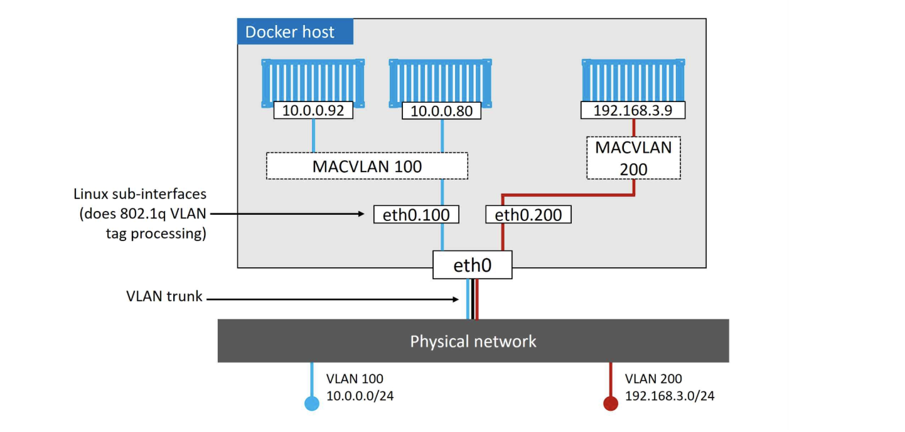

# Docker

## Client Commands

```bash
# to show your current storage driver
docker system info
# see docker version using
docker version
# add a user to the docker unix group
usermod -aG docker USERNAME

# build an image
docker image build -t maria:test .
# show images
docker image ls
# show images with its digest
docker image ls --digest
# show id of all the images
docker image ls -q
# filter images (dangling, before, since, label and reference)
docker image ls --filter dangling=true
docker image ls --filter=reference="*:latest"
# show images with formatted output using Go templates
docker image ls --format "{{.Repository}}: {{.Tag}}: {{.Size}}"
# delete dangling images
docker image prune
# delete unused and dangling images
docker image prune -a
# deletes an image
docker image rm mariavalcam/cryptogo:v1
# deletes all images
docker image rm $(docker image ls -q) -f
# pull all tags from a repository
docker image pull -a mariavalcam/cryptogo
# See layers of an image
docker image inspect mariavalcam/cryptogo:v1

# See build history of an image
docker history mariavalcam/cryptogo:v1

# search a repository
docker search mariavalcam
docker search alpine --filter is-official=true
docker search alpine --limit 100
# login in a registry
docker login

# show containers (use -a to list stopped containers too)
docker container ls
# run a container (use Ctrl-P Ctrl-Q to exit the container without terminating it)
# The -it flag to make container interactive and attach it to our terminal
docker container run --name ubuntutest -it ubuntu:latest /bin/bash
# runs a container with a restart policy
docker container run -d --name restartexample --restart always alpine sleep 1d
# stop a container
docker container stop ubuntutest
# start a stopped container
docker container start ubuntutest
# remove a stopped container
docker container rm ubuntutest
# delete all containers
docker container rm $(docker container ls -aq) -f
# see detailed configuration an runtime information about a container
docker container inspect ubuntutest
# attach to a running container
docker containers exec -it CONTAINER_NAME bash

####################
# network
####################
# list networks on that host
docker network ls
# shows low-level details
docker network inspect
# Inspect the underlying Linux bridge in the kernel
ip link show docker0
# create a network
docker network create -d bridge mynetwork
# create a macvlan network
docker network create -d macvlan --subnet=10.0.0.0/24 --ip-range=10.0.0.0/25 --gateway=10.0.0.1 -o parent=eth0.100 mymacvlan
# run a container with a specific network
docker container run -d --name maria --network mynetwork ubuntu sleep 1d
# see all bridges on the system
brctl show
# run a container using port-mapping
docker container run -d --name frontend --network mynetwork -p 8080:80 nginx
# view port mappings
docker port frontend
# delete all unused networks
docker network prune
# Delete a specific network
docker network rm mynetwork

####################
# troubleshooting
####################
# troubleshooting if using systemd
journalctl -u docker.service
# if not using systemd
tail -f /var/log/upstart/docker.log
tail -f /var/log/daemon.log
# check container logs, some logging drivers dont work with this
docker container logs mycontainer
```

## Introduction

**Versioning**

Starting of Q1 2017, Docker version numbers follow the YY.MM-xx versioning scheme.

The Enterprise Edition has quarterly releases and it is supported for 12 months. The Community Edition has quarterly releases too but will be supported for 4 months

**Differences between containers and VMs**


VMs require its own dedicated OS. Every OS consumes CPU, RAM and storage and this OS needs patching and monitoring. In the VM model, when the physical server is powered on, once the hypervisor boots, it lays claim to all physical resources (CPU, RAM, storage, NICs,..). The hypervisor then carves these hardware resources into virtual versions that look and feel exactly like the real ones. It then packages them into a software construct called Virtual Machine. We then take all those VMs and install OS and applications.

All containers in a single host share a single Kernel. So containerised apps designed to run on a Windows kernel, will not run on a Linux host. This frees CPU, RAM and storage, reduces licensing cost, patching overhead, less time to initialize hardware and kernel bootstrap,.. This is done thanks to kernel namespaces, control groups, union filesystems and Docker.

 - kernel namespaces: are a feature of the Linux kernel that partitions kernel resources such that one set of processes sees one set of resources while another set of processes sees a different set of resources. Since kernel version 4.10, there are 7 kinds of namespaces, which resource is isolated depends on the kind of namespace that has been created for a given process group. Types: Mount, process ID, network, interprocess communication (IPC), UTS, User ID, Control Group
 - Control groups (cgroup): is a Linux kernel feature that limits, accounts for, and isolates the resource usage (CPU, memory, disk I/O, network, etc.) of a collection of processes.
 - Unionfs is a filesystem service for Linux which implements a union mount for other file systems. It allows files and directories of separate file systems, known as branches, to be transparently overlaid, forming a single coherent file system

When the server is powered on, your choosen OS boots. The OS claims all the hardware resources. On top of the OS, we install a container engine, it takes the OS resources and carves them up into secure isolated constructs called containers. Each container looks and feels like the real OS.

At a high level, we can say that hypervisors perform a hardware virtualization (split physical hardware into virtual versions). On the other hand, containers perform OS virtualization (stplits OS resources into virtual versions).

**Open Container Initiative (OCI)**

Governance council responsible for standardize images and container runtime.

**Docker Engine (container runtime)**
The Docker Engine is the infrastructure software that runs and orchestrates containers. It has a modular design with many swappable components (based on OCI standards when possible). Major components of the docker engine are:


 * Docker daemon: It is just an HTTP REST API. It communicates with containerd via CRUD-style API over gRPC.
 * containerd: Its purpose was to manage lifecycle operations (start, stop, pause, rm,...). Overtime, it has taken on more functionality (image management). It converts the required Docker image into an OCI bundle and tells runc to use it to create a new container.
 * runc: is based on the OCI container-runtime-spec. When Docker was first released, it used LXC to access fundamental building-blocks of containers that existed in the Linux kernel (namespaces, cgroups,...). As LXC was Linux-specific, Docker replaced it with a tool called libcontainer, that is platform agnostic. runc is a small lightweight CLI wrapper for libcontainer, its only purpose is to create containers. The container process is started as a child-process of runc and as soon as it is started, runc will exit (then the associated containerd-shim process becomes the containers parent, containerd-shim reports containers status back to the daemon and keep STDIN and STDOUT streams).

In a default Linux instalation, the client talks to the daemon via a local IPC/Unix socket at /var/run/docker.sock

## Images
A docker image is like a stopped container (in fact, you can stop a container and create a new image from it). Inside of the image, there is a cut-down operating system (they contain just enough from the operating system, but they dont contain a kernel) and all of the dependencies and files to run and application.

Local images on Linux are located in /var/lib/docker/<storage-driver>.

**Images layers**

Images are made up of multiple layers that get stacked on top of each other and represented as a single object. The image itself is really just a configuration object that lists the layers and some metadata.

Docker 1.10 introduced a new content addressable storage model. As part of this model, all images now get a cryptographic content hash called `digest`.

The layers are where the data lives and they are independent and has no concept of being part of a collective image. Each layer is identified by a cryptoID called `content hashes` that is a hash of its content. As images are compressed to save bandwidth, there is a `distribution hash` for the compressed version of the layer.

Some docker images also support different architectures, these are called `Multi-architecture images`. this means a single image (repository:tag) can have an image for windows, Linux, ARM,... This is supported by `manifest lists`. So a Registry supports manifests and manifests lists. A manifests list is a list of architectures supported by  a particular image tag, each with its own manifest detailing the layers.


**Images and containers**

Once you have started a container from an image, the two constructs become dependent on each other and you cannot delete the image until the last container using it has been stopped and destroyed.

**Image Registries**

The default one is DockerHub. Here you can find official repositories (approved by Docker) and unofficial repositories.

DockerHub images names are `<repository>:<tag>`, but if you use a different registry, the name will be `<registry>/<repository>:<tag>`.

**Dangling Images**

A dangling image is an image that is no longer tagger and it appear as `<none>:<none>`. It happens when a different image is tagged with the same tag and the old one gets overridden and becomes a dangling image.

**Creating an image**

The directory containing the application is referred to as the build context. It's a common practice to keep your Dockerfile in the root directory of your build context.

When creating an image, we want it to be small and reduce the number of dependencies it has. this is why multi-stage builds are recommended. You can create an image to compile your app and copy the binary to a new image (reducing size and dependencies).

Dockerfile instructions:
 * FROM: base layer of the image. You can use several FROM for multi-stage images, each FROM instruction is a new build stage (You can add a specific name for it, like: `FROM node:latests AS compilestage`).
 * LABEL: its simple key-value pairs used to add metadata to an image
 * RUN: executes an instruction on a container using an image with the previous layers. It creates a snapshot of the container when the instruction finishes.
 * COPY: copies files from the build context. You can copy artefacts form previous stages using --from, like: `COPY --from=compilestage /app/myapp .`
 * WORKDIR: set the working directory for the rest of the instructions. This is added as metadata.
 * EXPOSE: to add metadata about the port it uses
 * ENTRYPOINT: set the main application that the container should run. This is also added as metadata.

 You can squash an image to produce a single layer. This is a good practice for images that will be used in FROM. Use `--squash` to build the image

 Note: When doing apt-get install, you should use no-install-recomends flag so it only installs main dependencies.

 **Build cache**

 The build process used by Docker uses a cache. So, if you build an image twice, the second time it will complete almost instantaneously, by using layers from the previous build.

 Docker checks its build cache for a layer that was built form the same image and using the same instruction asked to execute. If it does, it uses that layer, if it doesn't, it is cache miss and it builds a new layer (it will invalidate the cache so subsequent instructions are completed in full without attempting to reference the build cache).

You can force to build process to ignore cache using `--no-cache=true`.

Note: COPY and ADD instructions include steps to ensure that the content being copied into the image has not changed since the last build (it performs a checksum agains each file being copied).

## Containers
A container is the runtime instance of an image. A container run until the app they are executing exits.

**Persist data**

If you run a container, then create a file and then stop the container, that file will still be there is you re-start the container.

The preferred way to store persistent data in containers are Volumes.

**Kill a container**

docker container stop NAME sends a SIGTERM signal to the PID1 process inside of the container. This gives the process a change to shut itself down. If it does not exits within 10 second, it will receive a SIGKILL (bullet int he head).

Using docker container stop NAME -f goes straight to send a SIGKILL.

**Restart policies**

There are 3 restart policies:
 * always: it always restart a stopped container (unless it has been explicitly stopped). It will also be restarted when Docker daemon starts.
 * unless-stopped: similar to always, but the container won't be restarted when the daemon restarts if they where in the Stopped (Exited) state
 * on-failure: will restart the contaienr if it exists with a non-zero code. It will also restart a container when the Docker daemon restarts even containers that were in the stopped state.

## Networking
Docker Networking uses `libnetwork`, which is based on an open-source pluggable architecture called the Container Network Model (CNM).

**CNM Model**

The intention is for CNM to implement and use any kind of networking technology to connect and discover containers. It defines three parts:


 1. Sandbox: contains the configuration of a container's network stack (ethernet, container interface, routing table and DNS). Note sandboxes are placed inside of containers.
 2. Endpoint: it is a virtual network interface (Eg: `veth`). It joins the Sandbox to a network.
 3. Network: it is like a switch. It helps endpoints to communicate directly.

Note: Kubernetes uses the Container Network Interface (CNI) specification, not CNM. CNI is capable of addressing other containers' IP addresses without resorting to network address translation (NAT). This CNI plug-in creates a pseudo interface, attaches it to the relevant underlay network, sets IP Address / Routes and maps it to the POD namespace

**libnetwork**

Libnetwork provides the network control plane and management plane (native service discovery, ingress-based container load balancing). Drivers provide the data plane (connectivity and isolation).


*Port mappings*: it allows to map a container port to a port on the Docker host.

*Docker DNS service*: All new containers are registered with the embedded Docker DNS resolver so can resolve names of all other containers in the same network. It also configured a DNS Server. You can change the container DNS config by changing `/etc/resolv.conf` or using the tags `--dns` and `--dns-search` Note: the default bridge network (`docker0`) is the only network that does not support name resolution via Docker DNS service.

**Drivers**

Docker native networking drivers are (they can be all active at the same time):

 * bridge: it creates single-host bride networks. Every Docker host gets a default bridge network and all new container will attach to it unless you override it (using `--network` flag). The default "bridge" network maps to an underlying Linux bridge in the Kernel called `docker0`.
 * MACVLAN: Multi-host network. Containers will have its own MAC and IP addresses on the existing physical network (or VLAN). Good things: it is easy and does not use port-mapping. Bad side: the host NIC has to be in promiscuous mode (most cloud provider does not allow this). To configure a MACVLAN diver, you need to specify: subnet info, gateway, range of IPs that it can use to assign to containers and which interface on the host to use.

 

 * overlay: Multi-host network. It allows you to create a flat, secure, layer-2 network. We would need to connect the hosts as a cluster using docker swarm tho. Docker overlay networking uses VXLAN tunnels to create virtual Layer 2 overlay networks. A virtual switch called Br0 is created inside the sandbox. A VTEP is also created with one end plumbed into the Br0 switch and the other plumbed into the host network stack (VTEP). The host network gets an IP address on the underlay network the host is connected to and bound to the 4789 udp port.


## Upgrade Docker on Ubuntu

```bash
apt-get update
apt-get remove docker docker-ce docker.io docker-engine -y
wget -q0- https://get.docker/com | sh
systemctl enable docker
```

## Storage Drivers
Every Docker container gets a local storage that is managed by the storage driver. Docker for Linux support several storage drivers (configured on /etc/docker/daemon.json):
 * aufs (original and oldest)
 * overlay2
 * devicemapper
 * btrfs
 * zfs

Each storage driver has its own subdirectory on the host (usually under /var/lib/docker/STORAGE_DRIVER/). So if you change the storage driver, existing images and containers will not be available

It is also called  *Snapshotter* as is responsible for stacking layers and presenting them as a single unified filesystem.
