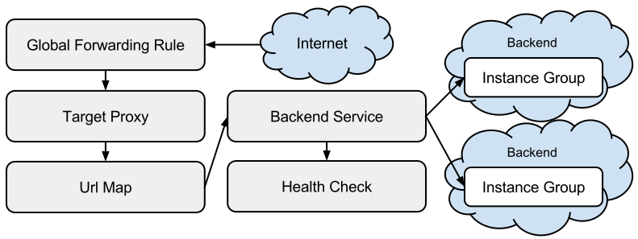

# Gcloud

## Configuration

```bash
# Configure
gclound init

# With a service account
gcloud auth activate-service-account SERVICE_ACCOUNT_EMAIL --key-file /path/to/file
```

## VM

```bash
# List Vms
gcloud compute instances list
# List Disk
gcloud compute disks list
```

**Instance Templates**

```bash
# Create instance template
cat << EOF > startup.sh
#! /bin/bash
apt-get update
apt-get install -y nginx
service nginx start
sed -i -- 's/nginx/Google Cloud Platform - '"\$HOSTNAME"'/' /var/www/html/index.nginx-debian.html
EOF

gcloud compute instance-templates create nginx-template --metadata-from-file startup-script=startup.sh

# Create an instances in a group (we need a target pool for that)
gcloud compute target-pools create nginx-pool
gcloud compute instance-groups managed create nginx-group \
         --base-instance-name nginx \
         --size 2 \
         --template nginx-template \
         --target-pool nginx-pool

# Create a firewall rule to reach them
gcloud compute firewall-rules create www-firewall --allow tcp:80
```


## Network

**Load Balancers**

1 - L3 Network Load Balancer
```bash
# create a L3 network load balancer
gcloud compute forwarding-rules create nginx-lb \
         --region europe-west1 \
         --ports=80 \
         --target-pool nginx-pool

# List all forwarding rule in the project (you should be able to connect to http://IP_ADDRESS/)
gcloud compute forwarding-rules list
```


2 - L7 HTTP(s) Load Balancer
An HTTP(S) load balancer is composed of several component:



```bash
# Create a health check (to verify that the instance is responding to HTTP traffic)
gcloud compute http-health-checks create http-basic-check
# Define an HTTP service and map a port name to the relevant port for the instance group
gcloud compute instance-groups managed set-named-ports nginx-group --named-ports http:80
# Create a backend service for nginx-group and using http-basic-check
gcloud compute backend-services create nginx-backend --protocol HTTP --http-health-checks http-basic-check --global
gcloud compute backend-services add-backend nginx-backend \
    --instance-group nginx-group \
    --instance-group-zone europe-west1-c \
    --global

# Create a default URL map that directs all incoming requests to all your instances
gcloud compute url-maps create web-map --default-service nginx-backend
# Create a target HTTP proxy to route requests to your URL map:
gcloud compute target-http-proxies create http-lb-proxy --url-map web-map
# Create a global forwarding rule to handle and route incoming requests
gcloud compute forwarding-rules create http-content-rule \
        --global \
        --target-http-proxy http-lb-proxy \
        --ports 80
# You can list forwarding rules (it may take a while to appear, you should be able to connect to http://IP_ADDRESS/.)
gcloud compute forwarding-rules list
```

## Identity and Access Management (IAM)

```bash
# Add role roles/container.admin to a service account
gcloud projects add-iam-policy-binding PROJECT_NAME --member serviceAccount:SERVICE_ACCOUNT_EMAIL --role roles/container.admin

# Set GOOGLE_APPLICATION_CREDENTIALS
gcloud auth application-default login
```

## Kubernetes engine

```
# List clusters
gcloud container clusters list

# Autoscale nodes
gcloud beta container clusters update <cluster-name> --enable-autoscaling --min-nodes=3 --max-nodes=7 --zone=<cluster-zone> --node-pool=default-pool

# Disable Autoscale nodes
gcloud beta container clusters update <cluster-name> --enable-autoscaling --min-nodes=3 --max-nodes=7 --zone=<cluster-zone> --node-pool=default-pool

# Add additional zone
gcloud beta container clusters update <cluster-name> --additional-zones=europe-west1-c

# Add node-pool
gcloud beta container node-pools create high-spec --machine-type=n1-highcpu-2 --preemptible --num-nodes=1

# Resize nodes on a zone
gcloud container clusters resize <cluster-name> --size=2

# Delete nodepool
gcloud beta container node-pools delete high-spec
```

## KMS
Encrypted credentials are stored in a bucket. To encrypt and decrypt this credentials we need a CryptoKey and a KeyRing in our Google Cloud KMS.

**Credentials IAM**

In KMS, there are two major permissions to focus on:
* manage KMS resources (`cloudkms.admin`).
* use keys to encrypt and decrypt data (`cloudkms.cryptoKeyEncrypterDecrypter`).

We expect every team lead to have this credentials. To guarantee you can use:

```
# Manage a key
gcloud kms keyrings add-iam-policy-binding $KEYRING_NAME \
    --location global \
    --member user:$USER_EMAIL \
    --role roles/cloudkms.admin

# Encrypt/Decrypt with a key
gcloud kms keyrings add-iam-policy-binding $KEYRING_NAME \
    --location global \
    --member user:$USER_EMAIL \
    --role roles/cloudkms.cryptoKeyEncrypterDecrypter
```

**Viewing Cloud Storage audit logs**

To view the activity for any resource in KMS, return to the Encryption keys page (IAM & admin > Encryption keys), check the box next to your key ring, then click on the Activity tab in the right menu. This will take you to the Cloud Activity UI, where you should see the creation and all modifications made to the KeyRing.
