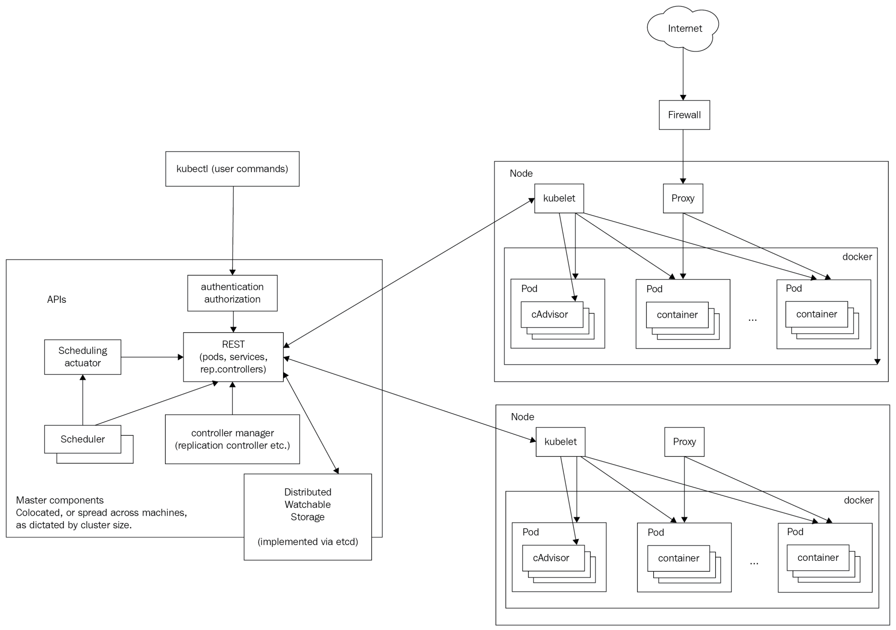

# Kubernetes

It is an opensource project created by Google that is part of the Cloud Native Foundation (CNCF)

Main features:
 * Mounting storage systems
 * Distributing secrets
 * Checking application health
 * Replicating application instances
 * Using horizontal pod autoscaling
 * Naming and discovering
 * Balancing load
 * Rolling updates
 * Monitoring Resources
 * Accessing and ingesting logs
 * Debugging applications
 * Providing authentication and authorization

## Components

**Architecture**



*Master*: control plane. It includes:
 - API server: exposes Kubernetes REST API.
 - etcd: datastore used by Kubernetes to store the entire cluster state.
 - Kube-scheduler: it schedules pods into nodes. It checks: resource requirements, service requirements, hardware/software policy constrains, Node affinity/anti-affinity, Pod affinity/anti-affinity, taints and tolerations, data locality and deadlines
 - Kube controller manager: collection of managers rolled up in 1 binary. They check the state of the cluster to reach the desired state.
 - Cloud controller manager: this replaces some controller manager functionality to allow the cluster interact with the cloud provider. Kubernetes defines an interface for it in Go so any cloud provider can implement it.
 - DNS: every service (except headless services) receives a DNS name. Pods can receive a DNS name too. This is very useful for automatic discovery.

*Node*: it is a physical or virtual machine.
 - kube-proxy: does a low level, network housekeeping on each node. It finds cluster IPs through environment variables or DNS.
 - kubelet: it oversees communicating with the master components and manages the running pods.

**Resources**

*Pod*: unit of work. All the containers in a pod have the same IP and port space (they can comunicate using localhost or standard interprocess communication).
*ReplicaSet*: it manages a group of pods identified by a label and unsures they are up and running.
*Services*: level 4 routers (TCP/UDP). They are published or discovered through DNS or env vars.
*Volumes*: to have persistent data. It uses different volumes than Docker.
*StatefulSet*: ensures there are a given number of pets with unique identities running at any given time. they have: stable hostname, ordinal index, Stable storage.
*Secrets* objects containing sensitive information

**Other**

*Labels*: key-value pairs that are used to group sets of objects. The label key has a prefix (optional) and a name (mandatory) separated by a slash (`/`). The name can be 63 char long at maximum and prefix can be 153 char long. they can have alphanumeric characters, dots, dashes and underscores.
*Label selectors*: used to select objects. Eg: `app=main-api`, `app=main-api, version!=v3`, `version in (v3, v4)`
*Annotation*: metadata for objects. They have no restrictions.
*Names*: each object is identified by a UID and a name.
*Namespaces*: is a virtual cluster totally isolated form other namespaces.

## Distributed systems design patterns

Kubernetes supports the following patters:
 * Sidecar pattern: co-locating another container in a pod. the main app is unaware of this sidecar.
 * Ambassador: representing a remote service as if it was local.
 * Adapter: standarazing output form the main application.

 Note: Multinode patters such as leader election, work queues, and scatter-gather, are not supported directly, but you can accomplish them composing pods.

## Kubernetes API

You can use `kubectl cli` or REST API calls to reach it.

API groups: is specified in a REST path and in the apiVersion field of a serialized object. The named groups are at REST path /apis/$GROUP_NAME/$VERSION, and use apiVersion: $GROUP_NAME/$VERSION

Resource categories: ()
 * Workloads: objects to manage containers
   - apps/daemonset
   - apps/deployment
   - apps/ReplicaSet
   - apps/StatefulSet
   - batch/cronjob
   - batch/job
   - core/containers
   - core/pod
   - core/replicationcontroller

 * Discovery and load Balancing: objects to expose workloads
   - core/endpoints
   - core/service
   - extensions/ingress

 * Config and storage: objects for configuration
   - core/configmap
   - core/secret
   - core/persistentvolumeclaim
   - storage/storageclass
   - storage/volumeattachment

 * Cluster: objects to define the cluster
   - core/namespace
   - core/node
   - core/persistentvolume
   - core/resourcequota
   - rbac/clusterrole
   - networking/networkpolicy

 * Metadata: Metadata resources are responsible for configuring behaviour of your other Resources within the Cluster.
   - autoscaling/HorizontalPodAutoscaler
   - policy/PodDisruptionbudget
   - core/Event
   - extensions/PodSecurityPolicy
   ...


## Monitoring, Logging, and Troubleshooting

**Heapster**
is a monitor solution for Kubernetes clusters. It runs in a pod and collects operational metrics and events from every node. Stores all this data on a database (typically InfluxDB or Prometheus) and a frontend tool can be used to visualise it (Typically Grafana).

Note: Prometheus has a operator that makes it really easy to install and scale. It will install Prometheous, Grafana and Alertmanager It is based on Google's Borgmon.

The database stores metrics labeled with pod_id, pod_name, pod_namespace, contaienr_base_image, container_name, host_id, hostname, labels, namespace_id, resource_id. The metrics shown are: cpu/limit, cpu/node_capacity, cpu/request, cpu/usage, filesystem/limit, filesystem/available, memory/limit...


**cAdvisor** runs on every node, it collects information about CPU, memory, network and filesystems for each container. It provides a basic UI on port 4194.

**Kubernetes Dashboard**
it provides an intuitive drill-down interface, from the cluster level all the way down to individual container.

**Logging**
Is not added by default, typically, you would need to add a logger agent in each node to collect the logs and store them somewhere. The typical solution is fluentd-Elasticsearch-Kibana. GKE has its own solution (Stackdriver).

**Node Problem Detector**
Is a pod that runs on every node. It tries to detect problems affecting kernel, cpu, memory or filesystem. In Kubernetes 1.10, problems daemons are baked into the node problem detector binary and executed as Gorutines.

## kubectl
```bash
# Forward port
kubectl port-forward $POD_NAME $PORT:$PORT

# Volume Claim
kubectl get pvc

# Get HorizontalPodAutoscaler
kubectl get hpa

# Most used pods
kubectl top pods -n sock-shop

# increase pod cpu
kubectl exec -itn sock-shop <front-end-pod-name> -- sh -c 'yes > /dev/null'

# Do raw request to api
kubectl get --raw "/apis/metrics.k8s.io/v1beta1/nodes" | jq

# Evict pods on a node
kubectl drain no-name

# Scale pods
kubectl scale deployment/carts --replicas=3 -n=sock-shop

# Taint node
kubectl taint nodes node1 node2 key=value


# setting cluster admin role for a service account
kubectl create clusterrolebinding cluster-role-resource-name --clusterrole=cluster-admin --serviceaccount=nginx-ingress:default

# get ingress with specific data
kubectl get ingress -o=jsonpath='{range .items[*]}{.metadata.name}{"\t"}{.metadata.annotations.kubernetes\.io/ingress\.class}{"\n"}{end}'
```

## Container Runtime Interface (CRI)

It is the piece of Kubernetes that starts and stops containers. The default is Docker (it may be replaced by containerd). It supports several different runtimes: docker, rkt, cri-o, frakti, cri-containerd and rktlet.

CRI is a gRPC API, containing spec and libaries for container runtimes to integrate with kubelet on a node. There are two gRPC service interfaces (ImageService and RuntimeService) that CRI container runtimes must implement.

### Config

A configuration file describes clusters, users, and contexts.
 - Context: relates user and cluster
 - Cluster: defines Kubernetes clusters
 - Users: credentials to access to a kubernetes cluster
