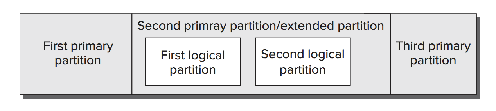

# Linux
## Directories
Directories in Linux are sorted by purpose, So for a path like:
  `/usr/local/share/emacs`  ->  `<Scope(/usr/local)>/<Category(share)>/<Application(emacs)>`

Categories:
 * For configuration: etc (miscellaneus config files), init.d (config files for booting Linux), rc.d (config files for booting linux)
 * For documentation: doc for documentation, info (emacs help system), man (man help) and share (examples or/and instalation)
 * For programs: bin for binay files, sbin for superuser binary files, and lib for libraries
 * For programming: include, src
 * For web files: cgi-bin, html, public_html, www
 * For display: fonts, X11
 * For hardware: dev (devices), media (mount point), mnt (mount point)
 * For runtime files: var, lock, log, mail, run (contains PIDs), spool, tmp, proc (OS state)

 Scopes: describes, at a high level, the pur‐ pose of an entire directory hierarchy
 * / :root
 * /usr : user
 * /usr/local : system files developed locally
 * /usr/games
 ...

OS directories:
 * `/boot`: where the kernel lives
 * `/lost+found` damaged files that were rescued by a disk recovery tools
 * `/proc` describes currently running processes


## Libraries

The mayor Linux package management tools are RPM and Debian packages. They aren't compatible. They keep information about packages, files in those packages, checksums, dependencies of those packages,.. they also allow upgrades, uninstallation and help creating binary packages

**RPM**

Created by RedHat under General Public License. It is the most popular package manager. It maintains a database that allows for identifying conflicts and ownership of particular files.

Convention for naming:
   ` packagename  -      a.b.c       -       x        .     arch      .rpm`
   `<packagename> - <version-number> - <build-number> . <architecture>.rpm`

Problems: as an RPM package is designed for one distribution (arch) a package may require a newer version of a library than is present on the distribution you are using.

Syntax:
  `rpm <operation><options> <package-files|package-names>`

Operations: -i (install), -U (install/upgrade), -F (Upgrade), -q (Search in installed packages), -V (verifys a package), -e (Uninstall), -b (Builds a binary), --rebuild, --rebuilddb (rebuilds RPM database to fix errors)

Options: --force, --no-deps, --test, --all, -v (verbosity), -h (verbosity), -q -p (query an uninstalled package), -q -i (info), -q -l (list files for a package)

Other Commands:
* To extract data from rpm package: cpio, rpm2cpio
* To convert a RPM package to a Debian package: alien

Change config: `/usr/lib/rpm/rpmc` configures rpm, you should not change it tho, you should do changes in `~/.rpmrc` or `/etc/rpmrc`

**Yum**

Install RMP packages but it allows you to search in repositories (instead of manually downloading a package version).

Syntax:
  `yum <options> <command> <package...>`

Commands: install, update/upgrade, check-update, remove/erase, list, provides (packages provides by a program), search, info, clean (cleans up yum cache directory), shell, resolvedep, localupdate, deplist

Configuration: `/etc/yum.conf` and `/etc/yum.repos.d/` you should not change them tho. To add a repository, you should manually download the RPM that includes the repository configuration and install it using rpm

**Debian Packages**

Similar to RPM (they are not interchangeable tho). To use it, you need to know dpkg, dselect and apt-get commands:

* dpkg: similar to rpm. `dpkg <options><action> <package-files|package-names>`. Primary actions are: -i, --configure, -r (remove), -P (purge), -p (print info), -I (info about uninstalled package), --list, --audit

* apt-cache: provide information about the Debian package database
```bash
# display info about the package
apt-cache showpkg samba
# display apt statistics
apt-cache stats.
# show unmet dependencies
apt-cache unmet
# display dependencies
apt-cache depends samba
# Locate installed package
apt-cache pkgnames sa
```

* apt-get: equivalent to yum. `/etc/apt/sources.list` specifies locations from which important packages can be obtained. `apt-get <options> <command> <package-names>`

```bash
# Upgrades all installed packages to the newest versions available
apt-get upgrade
# Similar to upgrade, but performs “smart” conflict resolution
apt-get dist-upgrade
# Updates info about packages available from sources.list
apt-get update
# Install package
apt-get install docker
# Install package and fix if dependencies are broken
apt-get install -f docker
# Removes a package
apt-get remove
# check a package consistency
apt-get check
# housekeeping, it saves disk space
apt-get clean
```

* aptitude: package browser for available packages. `aptitude search samba`

**Shared libraries**

It shares libraries between programs (it normally includes the version on the name to be able to use different versions).

`/etc/ld.so.conf`: defines the library path. After you change your library path, you must use ldconfig. You can also change LD_LIBRARY_PATH to test a library (to avoid a global change)

Use `ldd` to display a program’s shared library dependencies. Example: `ldd /bin/ls`

## Processes

**Linux Kernel**

It virtualises all hardware devices and offers an API to talk to it.
```bash
# Print all info
uname -a
# Display network hostname
uname -n
# kernel name
uname -s
# kernel version
uname -v
# kernel version release
uname -r
# Machine CPU code
uname -m
# processor
uname -p
# hardware platform
uname -i
# os name
uname -o
```

**Processes**

```bash
# show all processes with detail and parents
ps faux
# monitor CPU consimed by processes, press q to quit, press M to sort by memory
top
# monitor cpi by a single process
top -p PID

# Pause a process, use bg if you want it to keep running in the background
Ctrl+Z
# check if there is a background process running in that terminal
jobs
# to restore a stopped job
fg
# execute a command specifing the priority
nice -n 12 watch ls
# kill a program with sigterm
kill -15 PID
# kill a program with sigkill
kill -15 PID
# kill all chrome
killall Chrome
```

## Configuring Hardware

**Firmware and core hardware**

All computers ship with a set of core hardware: a central processing unit (CPU, which does computational work), and random access memory (RAM, which holds data).

At the heart of much of this hardware is the firmware, which provides configuration tools and initiates the OS booting process.

Many hardware devices include firmware (for the motherboard, for a plug-in disk controller,..). The most important firmware, is installed on the computer’s motherboard, this firmware controls the boot process. In the past, most computers used to use BIOS, now most of them use EFI (or the newer UEFI).

The motherboard’s firmware resides in electronically erasable programmable read-only memory (EEPROM), aka flash memory.

When you turn on a computer:
1. the firmware performs a power-on self-test (POST):
  * initializes hardware to a known operational state
  * loads the boot loader from the boot device
2. Then it passes control to the boot loader
3. The boot loader loads the OS.

most BIOSs and EFIs provide an interactive facility to configure them: typically, pressing the delete key keys in the boot sequence

```bash
# configure PCI devices
lspci
# check kernel modules
lsmod
```

**interrupt request (IRQ)**

An interrupt request (IRQ) is a signal sent to the CPU instructing it to suspend its current activity and to handle some external event such as keyboard input.  IRQs are numbered from 0 to 15: 0 (System timer), 1 (keyboard), 2 (cascade for IRQs),.. ,12 (PS/2 mouse),...

 * `/proc/interrupts`: Once a Linux system is running, you can explore what IRQs are being used for various purposes by examining this file

**I/O Addresses**

 I/O Addresses are unique locations in memory that are reserved for communications between the CPU and specific physical hardware devices

 * `/proc/ioport`: to check i/o Addresses in the computer

 **Hard Disks**

 Three different hard disk interfaces are common on modern computers:
 * Parallel Advanced Technology Attachment (PATA), aka ATA
 * Serial Advanced Technology Attachment (SATA)
 * Small Computer System Interface (SCSI)

*Hard Disk Layout*: Whether your system uses PATA, SATA, or SCSI disks, you must design a disk layout for Linux (setting partitioning schemes and Linux mount points). This is good for: support multi-OS, use one partition for backups, protect from disk errors by ensuring users can only write to 1 partition,... Partitions: are defined by data structures that are written to specified parts of the hard disk. Several competing systems for defining these partitions exist:



 * MBR (Master Boot Record): older, partitions can be 2TiB maximum. Three partition types: Primary partitions, Extended partitions and Logical partitions (which reside within an extended partition). For any one disk, you’re limited to four primary partitions, or three primary partitions and one extended partition. The primary partitions have numbers in the range of 1–4, whereas logical partitions are numbered 5 and up. In addition to holding the partition table, the MBR data structure holds the primary BIOS boot loader—the first disk-loaded code that the CPU executes when a BIOS-based computer boots.

 * GPT (GUID Partition Table): GPT is the preferred partitioning system for disks bigger than 2TiB (it is also normal use GTP for smaller disks). GPT’s main drawback is that support for it is relatively immature. The fdisk utility doesnt work with it.

*Mount Points*: an OS must have some way to access the data on the partitions. In Windows, this is done by assigning a drive letter, such as C: or D:, to each partition. Linux uses a unified directory tree. Each partition is mounted at a mount point in that tree. Mounting the filesystem is the process of linking the filesystem to the mount point:
 * Common partitions: `/home` (Holds users’ data files), `/boot` (Holds critical boot files), `/usr` (Holds most Linux program and data files), `/usr/local` (Holds Linux program and data files that are unique to this installation), `/opt` (Holds Linux program and data files that are associated with third-party packages), `/var` (Holds miscellaneous files associated with the day-to-day functioning of a computer), `/tmp` (temporary files)


## General Commands

```bash
# Use Extended and recursive Pattern matching for all files in a directory and subdirectories
grep -E --color -r "maria|valero" ./
# show name of files that matches a string
grep -rl 'maria' ./
# change app for application
sed 's/app/application/g' Dockerfile

# users logged in
who
```

## Security
###  gpg
```bash
# Decrypt
INPUT=${2}
OUTPUT=$(echo "${INPUT}" | sed 's/.gpg$//g')
gpg --decrypt ${INPUT} > ${OUTPUT}

# Encrypt
PUBLIC_KEY_DIRECTORY="./public_keys"
function import_recipients {
    RECIPIENT_LIST=""
    PUBLIC_KEY_DIR_FILES="$(ls -1 ${PUBLIC_KEY_DIRECTORY})"
    for PUBLIC_KEY in ${PUBLIC_KEY_DIR_FILES}; do
      gpg --import ${PUBLIC_KEY_DIRECTORY}/${PUBLIC_KEY}
      RECIPIENT_LIST="${RECIPIENT_LIST} --recipient ${PUBLIC_KEY}"
    done
}
INPUT=${2}
OUTPUT=$(echo "${INPUT}.gpg")
gpg --always-trust --output ${OUTPUT} ${RECIPIENT_LIST} --encrypt ${INPUT}
```

## Networking
```bash
# Reload routing table
sudo ifconfig en0 down && sudo route flush && sudo ifconfig en0 up

# See postgres connections
sudo netstat -tupn | grep postgres | awk 'sub(/:[0-9]+/,"",$5){ print $5 }' | sort | uniq -c
```


## Memory

```bash
# disk usage
sudo du -h --max-depth=1 /
```

## Packages

```bash
# Upgrade kernel distro (you need to restart the server after this)
apt-get dist-upgrade

# Remove a package
apt-get remove PACKAGE
```
